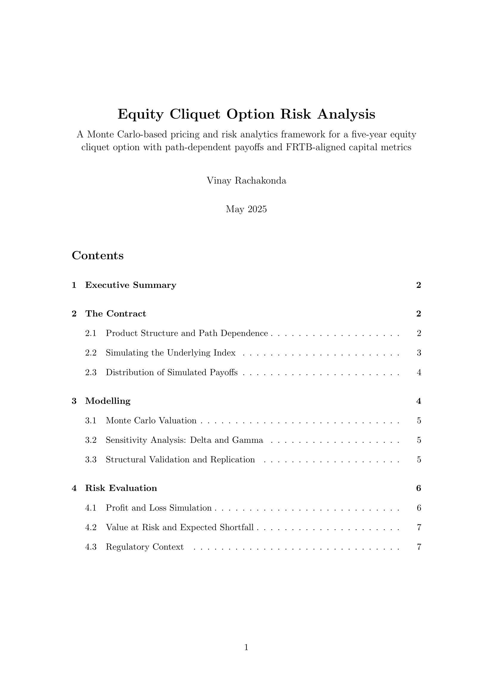

# exotic-equity-options
Monte Carlo engine for pricing exotic equity options with capped and floored returns. Features path-dependent payoff modelling, delta/gamma estimation, P&amp;L simulation with and without hedging, and risk metrics including 99% VaR and Expected Shortfall in line with FRTB capital standards.

